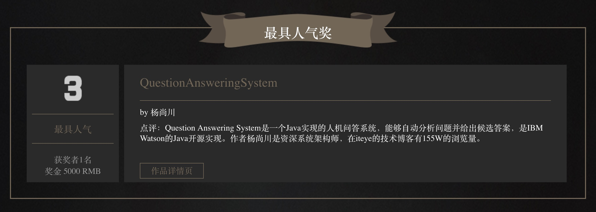

## QuestionAnsweringSystem是一个Java实现的人机问答系统，能够自动分析问题并给出候选答案。IBM人工智能计算机系统"沃森"（Watson）在2011年2月美国热门的电视智力问答节目"危险边缘"（Jeopardy！）中战胜了两位人类冠军选手，QuestionAnsweringSystem就是IBM Watson的Java开源实现。

[QuestionAnsweringSystem技术实现简要分析](http://blog.sina.com.cn/s/blog_9be6dec10102vq55.html)

[QuestionAnsweringSystem在100offer举办的「寻找实干和坚持的技术力量」Side Project赞助活动中荣获最具人气奖](http://i.100offer.com/projects/result)

[捐赠致谢](https://github.com/ysc/QuestionAnsweringSystem/wiki/donation)

## 使用方法

    1、安装JDK8和Maven3.3.3
        将JDK的bin目录和Maven的bin目录加入PATH环境变量，确保在命令行能调用java和mvn命令：
        java -version
            java version "1.8.0_60"
        mvn -v
            Apache Maven 3.3.3
            
    2、获取人机问答系统源码
        git clone https://github.com/ysc/QuestionAnsweringSystem.git
        cd QuestionAnsweringSystem
        建议自己注册一个GitHub账号，将项目Fork到自己的账号下，然后再从自己的账号下签出项目源码，
        这样便于使用GitHub的Pull requests功能进行协作开发。
    
    3、运行项目
        unix类操作系统执行：
            chmod +x startup.sh & ./startup.sh
        windows类操作系统执行：
            ./startup.bat

    4、使用系统
        打开浏览器访问：http://localhost:8080/deep-qa-web/index.jsp

## 工作原理

    1、判断问题类型（答案类型），当前使用模式匹配的方法，将来支持更多的方法，如朴素贝叶斯分类器。
    2、提取问题关键词。
    3、利用问题关键词搜索多种数据源，当前的数据源主要是人工标注的语料库、谷歌、百度。
    4、从搜索结果中根据问题类型（答案类型）提取候选答案。
    5、结合问题以及搜索结果对候选答案进行打分。
    6、返回得分最高的TopN项候选答案。
	
## 目前支持5种问题类型（答案类型）

    1、人名 
		如：
		APDPlat的作者是谁？
		APDPlat的发起人是谁？
		谁死后布了七十二疑冢？
		习近平最爱的女人是谁？
	2、地名
		如：
		“海的女儿”是哪个城市的城徽？
		世界上流经国家最多的河流是哪一条？
		世界上最长的河流是什么？
		汉城是哪个国家的首都？
	3、机构团体名
		如：
		BMW是哪个汽车公司制造的？
		长城信用卡是哪家银行发行的？
		美国历史上第一所高等学府是哪个学校？
		前身是红色中华通讯社的是什么？
	4、数字
		如：
		全球表面积有多少平方公里？
		撒哈拉有多少平方公里？
		北京大学占地多少平方米？
		撒哈拉有多少平方公里？
	5、时间
		如：
		哪一年第一次提出“大跃进”的口号？
		大庆油田是哪一年发现的？
		澳门是在哪一年回归祖国怀抱的？
		邓小平在什么时候进行南巡讲话？

## 增加新的问题类型（答案类型）

    1、在枚举类 org.apdplat.qa.model.QuestionType 中
       增加新的问题类型，并在词性和问题类型之间做映射。
       
    2、在资源目录 src/main/resources/questionTypePatterns 中增加新的模式匹配规则来支持新的问题类型的判定
       目录中的 3 个文件代表不同抽象层级的模式，只需要在其中一个文件中增加新的模式即可。
       
    3、在类 org.apdplat.qa.questiontypeanalysis.QuestionTypeTransformer 中
       将模式匹配规则映射为枚举类 org.apdplat.qa.model.QuestionType 的实例。
		
## API接口

	调用地址：
		http://127.0.0.1/deep-qa-web/api/ask?n=1&q=APDPlat的作者是谁？
	参数：
		n表示需要返回的答案的个数
		q表示问题
	编码：
		服务端和客户端均使用UTF-8编码
		服务端需要修改tomcat配置文件conf/server.xml，在相应的Connector中加入配置URIEncoding="UTF-8"
	返回json:
		[
			{
				"answer": "杨尚川",
				"score": 1
			}
		]
			
## 使用说明

1、初始化MySQL数据库(MySQL作为数据缓存区使用，此步骤可选)：   

    在MySQL命令行中执行QuestionAnsweringSystem/deep-qa/src/main/resources/mysql/questionanswer.sql文件中的脚本   
    MySQL编码：UTF-8，
    主机：127.0.0.1
    端口：3306
    数据库：questionanswer
    用户名：root
    密码：root
	
2、构建war文件并部署到tomcat：

    cd QuestionAnsweringSystem   
    mvn install
    cp deep-qa-web/target/deep-qa-web-1.2.war apache-tomcat-8.0.27/webapps/   
    启动tomcat
	
3、打开浏览器访问：

    http://localhost:8080/deep-qa-web-1.2/index.jsp
	
[可部署war包下载](http://pan.baidu.com/s/1hq9pekc)

## 在你的应用中集成人机问答系统QuestionAnsweringSystem

    QuestionAnsweringSystem提供了两种集成方式，以库的方式嵌入到应用中，以平台的方式独立部署。

    下面说说这两种方式如何做。

    1、以库的方式嵌入到应用中。

    这种方式只支持Java平台，可通过Maven依赖将库加入构建路径，如下所示：

    <dependency>
        <groupId>org.apdplat</groupId>
        <artifactId>deep-qa</artifactId>
        <version>1.2</version>
    </dependency>

    在应用如何使用呢？示例代码如下：
    
    String questionStr = "APDPlat的作者是谁？";
    Question question = SharedQuestionAnsweringSystem.getInstance().answerQuestion(questionStr);
    if (question != null) {
        List<CandidateAnswer> candidateAnswers = question.getAllCandidateAnswer();
        int i=1;
        for(CandidateAnswer candidateAnswer : candidateAnswers){
            System.out.println((i++)+"、"+candidateAnswer.getAnswer()+":"+candidateAnswer.getScore());
        }
    }

    运行程序后会在当前目录下生成目录deep-qa，目录里面又有两个目录dic和questionTypePatterns。
    dic是中文分词组件依赖的词库，questionTypePatterns是问题类别分析依赖的模式定义，可根据自己的需要修改。

    2、以平台的方式独立部署。

    首先在自己的服务器上如192.168.0.1部署好了，然后就可以通过Json Over HTTP的方式提供服务，使用方法如下所示：

    调用地址：
    http://192.168.0.1/deep-qa-web/api/ask?n=1&q=APDPlat的作者是谁？
    参数：
    n表示需要返回的答案的个数
    q表示问题
    编码：
    UTF-8编码
    返回json:
    [
        {
            "answer": "杨尚川",
            "score": 1
        }
    ]

## 深入了解

    QuestionAnsweringSystem由2个子项目构成，deep-qa和deep-qa-web。
    deep-qa是核心部分，deep-qa-web提供web界面来和用户交互，同时也提供了Json Over HTTP的访问接口，便于异构系统的集成。
    deep-qa是一个jar包，可通过maven引用：
    
    <dependency>
        <groupId>org.apdplat</groupId>
        <artifactId>deep-qa</artifactId>
        <version>1.2</version>
    </dependency>

    示例代码如下：

    String questionStr = "APDPlat的作者是谁？";
    Question question = SharedQuestionAnsweringSystem.getInstance().answerQuestion(questionStr);
    if (question != null) {
        List<CandidateAnswer> candidateAnswers = question.getAllCandidateAnswer();
        int i=1;
        for(CandidateAnswer candidateAnswer : candidateAnswers){
            System.out.println((i++)+"、"+candidateAnswer.getAnswer()+":"+candidateAnswer.getScore());
        }
    }

    运行程序后会在当前目录下生成目录deep-qa，目录里面又有两个目录dic和questionTypePatterns。
    dic是中文分词组件依赖的词库，questionTypePatterns是问题类别分析依赖的模式定义，可根据自己的需要修改。

## Watson介绍

    Watson is a computer system like no other ever built. 
    It analyzes natural language questions and content well enough and fast enough 
    to compete and win against champion players at Jeopardy!

[IBM Watson: How it Works](https://www.youtube.com/watch?v=_Xcmh1LQB9I)

[Building Watson - A Brief Overview of the DeepQA Project](https://www.youtube.com/watch?v=3G2H3DZ8rNc)
    
[This is Watson：A detailed explanation of how Watson works](http://ieeexplore.ieee.org/xpl/tocresult.jsp?isnumber=6177717)

[The DeepQA Research Team](http://researcher.watson.ibm.com/researcher/view_group.php?id=2099)

## 相关文章

[测试人机问答系统智能性的3760个问题](http://my.oschina.net/apdplat/blog/401622)

[人机问答系统的前世今生](http://my.oschina.net/apdplat/blog/420370)

[人机问答系统的类别](http://my.oschina.net/apdplat/blog/420720)

[What is Question Answering?](https://class.coursera.org/nlp/lecture/155)

## 其他人机问答系统介绍

1、OpenEphyra（Java开源）

    Ephyra is a modular and extensible framework for open domain question answering (QA). 
    The system retrieves accurate answers to natural language questions from the Web and 
    other sources. 
    
[OpenEphyra主页](http://www.ephyra.info/)

2、Watsonsim（Java开源）
    
    Open-domain question answering system from UNCC.
    Watsonsim works using a pipeline of operations on questions, candidate answers, and 
    their supporting passages. 
    In many ways it is similar to IBM's Watson, and Petr's YodaQA. 
    It's not all that similar to more logic based systems like OpenCog or Wolfram Alpha.
    
[Watsonsim主页](https://github.com/SeanTater/uncc2014watsonsim/)

3、YodaQA（Java开源）

    YodaQA is an open source Question Answering system.
    using on-the-fly Information Extraction from various data sources (mainly enwiki).
    YodaQA stands for "Yet anOther Deep Answering pipeline" and 
    the system is inspired by the DeepQA (IBM Watson) papers. 
    It is built on top of the Apache UIMA.
    
[YodaQA主页](https://github.com/brmson/yodaqa/)

4、OpenQA（Java开源）

    OpenQA is an open source question answering framework that unifies approaches from 
    several domain experts. 
    The aim of OpenQA is to provide a common platform that can be used to promote advances 
    by easy integration and measurement of different approaches.
    
[OpenQA主页](http://openqa.aksw.org/)

5、START（商业）

    START, the world's first Web-based question answering system, has been on-line 
    and continuously operating since December, 1993. 
    
    It has been developed by Boris Katz and his associates of the InfoLab Group 
    at the MIT Computer Science and Artificial Intelligence Laboratory. 
    
    Unlike information retrieval systems (e.g., search engines), 
    START aims to supply users with "just the right information" 
    instead of merely providing a list of hits. 
    
    Currently, the system can answer millions of English questions about 
    places (e.g., cities, countries, lakes, coordinates, weather, maps, demographics, 
    political and economic systems), movies (e.g., titles, actors, directors), 
    people (e.g., birth dates, biographies), dictionary definitions, and much, much more.
    
[START主页](http://start.csail.mit.edu/index.php)

6、IBM Watson（商业）

    Watson is built to mirror the same learning process that we have.
    Watson has been learning the language of professions and is trained 
    by experts to work across many different industries. 
        
[IBM Watson主页](http://www.ibm.com/smarterplanet/us/en/ibmwatson/what-is-watson.html)
    
7、Siri（商业）

    Siri /ˈsɪri/ is a part of Apple Inc.'s iOS which works as 
    an intelligent personal assistant and knowledge navigator. 
    The feature uses a natural language user interface to 
    answer questions, make recommendations, and perform actions 
    by delegating requests to a set of Web services. 

[Siri主页](http://www.apple.com/ios/siri/)

8、Wolfram|Alpha（商业）

    Wolfram|Alpha introduces a fundamentally new way to get knowledge and answers 
    not by searching the web, but by doing dynamic computations based on a vast collection 
    of built-in data, algorithms, and methods.
    
[Wolfram|Alpha主页](http://www.wolframalpha.com/)
    
9、Evi（商业）
    
    Evi was founded in August 2005, originally under the name of True Knowledge, with the mission 
    of powering a new kind of search experience where users can access the world's knowledge simply 
    by asking for the information they need in a way that is completely natural.
    
[Evi主页](https://www.evi.com/)

10、微软小冰（商业）

    微软小冰是智能聊天机器人，基于微软搜索引擎和大数据积累，所有数据全部来自于公开的互联网网页信息。
    
[微软小冰主页](http://www.msxiaoice.com/)
    
11、Magi Semantic Search（商业）

    Magi is a search engine that gives you answers instead of references. 
    It's designed to be General, Feasible and Useful. 

[Magi Semantic Search主页](http://www.peak-labs.com/)
   
[https://travis-ci.org/ysc/QuestionAnsweringSystem](https://travis-ci.org/ysc/QuestionAnsweringSystem) 
